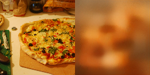
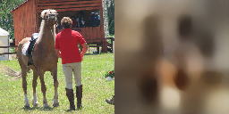
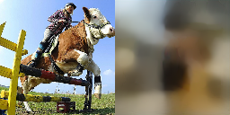

FMRI2IMG
==========

Sample basic autoencoder outputs.








WanDB: https://wandb.ai/aaalgo/fmri2image?workspace=user-aaalgo

Updates:

- Mar 27, 2023:  week signal obtained with autoencoder.

- Mar 25, 2023:  Using betas as input.  The data fitting becomes
  much faster, but the test set barely have any signal.

- Mar 24, 2023:  No signal yet.  Currently using a simple up-scaling
  conv net for decoding, so we avoid the hidden bugs when connecting to
  stable diffusion.  The code is in the "new" branch.  Some signal is
  visible in the training images on WanDB, but that is likely caused by
  overfitting.


# 1. Intro

This is an effort to reproduce the results of Takagi and Nishimoto
(https://sites.google.com/view/stablediffusion-with-brain/).

Currently the implementation is very preliminary.


# 2. Method

## Overview

The current implementation is heavily simplified:

- The brain voxels with high standard deviation through multiple fMRI
  scanns are identified.  Each such voxel contributes one dimension to
  the fMRI feature.
- The fMRI feature is `encoded` into hidden state via a single linear
  layer.
- The hidden state is fed into the Stable Diffusion pipeline in place of
  the prompt embeddings.
- The training code is based on the huggingface textual inversion script
  (in Links session).

# 3. Running

## 3.1 Data Download

## 3.2 Environment Setup

Edit local-config.py to override  default options in config.py.

## 3.3 Preprocessing

```
./convert_roi.py
./extract_beta.py
./create_dataset.py
./split.py
```
## 3.4 Train Basic AutoEncoder Model

```
./train_basic_ae.py
```


# 3. Links

* Dataset:
    - Paper: https://www.biorxiv.org/content/10.1101/2021.02.22.432340v1.full.pdf
    - Download: https://cvnlab.slite.page/p/CT9Fwl4_hc/NSD-Data-Manual
    - For now we only need the `nsddata_timeseries/ppdata/*/func1pt8mm/timeseries` of one subject.  Subject 1 or 2 have the best correct scores; use one of these.


* Textual Inversion:
    - https://huggingface.co/docs/diffusers/training/text_inversion
    - Script: https://github.com/huggingface/diffusers/tree/main/examples/textual_inversion

* fMRI Tutorial:
	- https://andysbrainbook.readthedocs.io/

# 4. Notes

## FreeSurfer

aseg: code 3/42: left and right celebral cortex
